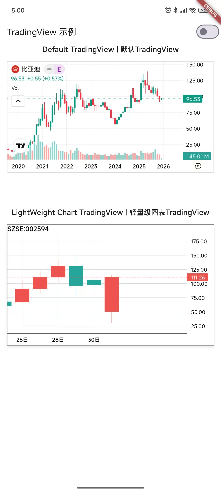

# TradingView Flutter

> **非官方版本声明**: 本软件包是一个非官方的 TradingView Flutter 封装器 (wrapper) 实现，旨在方便 Flutter 开发者集成 TradingView 图表功能。请注意，这并非 TradingView 官方提供的 SDK 或库。

[](https://pub.dev/packages/trading_view_flutter)
[](https://opensource.org/licenses/MIT)
[](https://flutter.dev)

一个高性能的 Flutter TradingView 图表集成库，提供完整的 TradingView 高级图表功能，支持股票、加密货币、外汇等多种金融产品的技术分析。

## 目录

- [👨🏼‍💻 演示图片](#-演示图片)
- [✨ 功能特性](#-功能特性)
- [🚀 安装指南](#-安装指南)
- [📁 项目结构](#-项目结构)
- [⚡ 快速开始](#-快速开始)
- [📚 API 文档](#-api-文档)
- [🔧 开发指南](#-开发指南)
- [❓ 常见问题](#-常见问题)
- [📄 许可证](#-许可证)
- [📈 版本历史](#-版本历史)


## 👨🏼‍💻 演示图片


## ✨ 功能特性

### 核心功能
- **完整 TradingView 图表** - 集成 TradingView 高级图表组件
- **轻量级图表支持** - 可选轻量级图表模式，减少资源占用
- **双主题支持** - 支持明暗两种主题模式（Light/Dark）
- **多区域配置** - 支持中国和全球不同区域的图表配色方案
- **高性能渲染** - 基于 WebView 的高性能渲染引擎
- **响应式设计** - 完美适配移动端和桌面端

### 图表配置
- **多种图表类型** - 支持面积图、柱状图、基线图、K线图、折线图
- **灵活时间间隔** - 支持从1分钟到月线的多种时间周期
- **技术指标集成** - 内置多种常用技术指标
- **绘图工具支持** - 提供丰富的图表绘图工具
- **样式深度定制** - 可自定义图表样式、颜色主题和布局
- **交互控制** - 支持手势交互和工具栏控制

## 🚀 安装指南

### 环境要求
- **Flutter**: >= 1.17.0
- **Dart**: >= 2.12.0
- **iOS**: >= 11.0
- **Android**: >= API 21

### 安装依赖

在 `pubspec.yaml` 中添加依赖：

```yaml
dependencies:
  trading_view_flutter: ^0.0.1
  webview_flutter: ^4.4.0  # 必需依赖
  logger: ^2.0.0           # 可选，用于调试日志
```

然后运行：

```bash
flutter pub get
```

### 平台配置

#### iOS 配置

在 `ios/Runner/Info.plist` 中添加网络权限：

```xml
<key>NSAppTransportSecurity</key>
<dict>
    <key>NSAllowsArbitraryLoads</key>
    <true/>
</dict>
```

#### Android 配置

在 `android/app/src/main/AndroidManifest.xml` 中添加网络权限：

```xml
<uses-permission android:name="android.permission.INTERNET" />
<application
    android:usesCleartextTraffic="true"
    ...>
    <!-- 其他配置 -->
</application>
```

## 📁 项目结构

`trading_view_flutter` 库采用模块化设计，结构清晰，便于维护和扩展：

```
lib/
├── src/
│   ├── config/
│   │   └── constant.dart             # 常量定义，包含 TradingView URL 等配置
│   ├── extensions/
│   │   └── date_fromatter.dart       # 日期格式化扩展，提供 DateTime 格式化功能
│   ├── model/
│   │   ├── chart_region.dart         # 图表区域枚举（global/china）
│   │   ├── chart_type.dart           # 图表类型枚举（area/bar/baseline/candlestick/line）
│   │   ├── chart_value.dart          # 基础图表数值模型
│   │   ├── interval.dart             # 时间间隔常量类（1分钟到月线）
│   │   ├── theme.dart                # 主题枚举（light/dark）
│   │   ├── trading_locale.dart       # 语言环境枚举及扩展
│   │   ├── trading_view_chart_data.dart # K线数据模型（open/high/low/close/time）
│   │   └── trading_view_data.dart    # 核心配置模型，包含所有图表参数
│   ├── trading_view_embedder.dart    # WebView 嵌入器，管理 WebView 生命周期和事件
│   ├── trading_view_js_interopt.dart # JavaScript 交互层，生成 HTML 和 JS 代码
│   ├── trading_view_light_chart.dart # 轻量级图表组件
│   └── trading_view_widget.dart      # 主 TradingView Flutter Widget
└── trading_view_flutter.dart         # 库入口文件，导出所有公共 API
```

### 模块功能详解

#### `lib/src/model` 目录

这个目录包含了所有与 TradingView 图表数据和配置相关的模型定义。它们是配置图表行为和外观的基础。

- **`trading_view_data.dart`**: 最重要的配置类，封装了所有用于初始化 TradingView 图表的参数，例如交易品种、时间间隔、主题、语言等。
- **`trading_view_chart_data.dart`**: K线数据模型，包含开盘价、最高价、最低价、收盘价和时间戳，用于轻量级图表的数据展示。
- **`interval.dart`**: 时间间隔常量类，提供从1分钟到月线的所有标准时间周期。
- **`theme.dart`**: 图表主题枚举，支持亮色和暗色两种主题。
- **`trading_locale.dart`**: 语言环境枚举（中文/英文）及对应的本地化字符串转换扩展。
- **`chart_region.dart`**: 图表区域枚举，用于区分中国和全球市场的不同配色方案。
- **`chart_type.dart`**: 图表类型枚举，支持多种图表展示形式。

#### `lib/src/trading_view_widget.dart`

这是库的主要 UI 组件。通过 `TradingViewWidget` 可以在 Flutter 应用中嵌入完整的 TradingView 图表，支持所有配置选项。

#### `lib/src/trading_view_light_chart.dart`

轻量级图表组件，提供更简洁、资源占用更少的图表展示方案，特别适合需要高性能渲染的场景。

#### `lib/src/trading_view_embedder.dart`

`TradingViewEmbedder` 类负责管理底层 `webview_flutter` 的逻辑，包括 WebView 生命周期管理、页面加载回调处理等。

#### `lib/src/trading_view_js_interopt.dart`

`TradingViewJsInteropt` 类是 Flutter 与 WebView 中 TradingView JavaScript 代码进行通信的桥梁，负责生成初始化图表所需的 HTML 和 JavaScript 代码。

#### `lib/trading_view_flutter.dart`

整个库的入口文件，导出了所有外部可以访问的类和函数，简化了导入过程。

### 依赖关系和兼容性

- **核心依赖**: `webview_flutter` - 用于嵌入 WebView
- **开发依赖**: `logger` - 用于调试日志输出（可选）
- **Flutter 版本**: 兼容 Flutter 1.17.0 及以上版本
- **平台支持**: iOS 11.0+, Android API 21+, 支持 Web 和桌面端

## ⚡ 快速开始

### 基础用法：标准 TradingView 图表

```dart
import 'package:flutter/material.dart';
import 'package:trading_view_flutter/trading_view_flutter.dart';

void main() {
  runApp(const MyApp());
}

class MyApp extends StatelessWidget {
  const MyApp({super.key});

  @override
  Widget build(BuildContext context) {
    return MaterialApp(
      home: Scaffold(
        appBar: AppBar(title: const Text('TradingView 示例')),
        body: const TradingViewExample(),
      ),
    );
  }
}

class TradingViewExample extends StatelessWidget {
  const TradingViewExample({super.key});

  @override
  Widget build(BuildContext context) {
    final tradingData = TradingViewData(
      id: 0,
      symbol: 'SZSE:002594',              // 股票代码
      autosize: true,                     // 自动调整大小
      interval: TradingViewInterval.day,  // 日线图
      timezone: 'Asia/Shanghai',          // 上海时区
      theme: TradingViewTheme.light,      // 明亮主题
      style: '1',                         // 图表样式
      locale: 'zh',                       // 中文界面
      hideTopToolbar: true,               // 隐藏顶部工具栏
      allowSymbolChange: false,           // 禁止切换品种
      saveImage: false,                   // 禁用保存图片
      showCalendar: true,                 // 显示日历
      hideVolume: false,                  // 显示成交量
      showDrawingToolBar: true,           // 显示绘图工具栏
      chartRegion: ChartRegion.china,     // 中国区域配色
    );

    return TradingViewWidget(
      width: MediaQuery.of(context).size.width,
      height: 400,
      data: tradingData,
    );
  }
}
```

### 轻量级图表示例

```dart
import 'package:flutter/material.dart';
import 'package:trading_view_flutter/trading_view_flutter.dart';

class LightChartExample extends StatelessWidget {
  const LightChartExample({super.key});

  @override
  Widget build(BuildContext context) {
    // 准备K线数据
    final List<TradingViewChartData> chartData = [
      TradingViewChartData(
        open: 100.0,
        high: 105.0,
        low: 95.0,
        close: 102.0,
        time: DateTime(2024, 1, 1),
      ),
      TradingViewChartData(
        open: 102.0,
        high: 108.0,
        low: 100.0,
        close: 106.0,
        time: DateTime(2024, 1, 2),
      ),
      // 更多数据...
    ];

    final tradingData = TradingViewData(
      symbol: 'BTCUSDT',
      isLightWeightChart: true,              // 启用轻量级图表
      chartValue: chartData,                 // 传入K线数据
      tradingViewChartType: TradingViewChartType.candlestick, // K线图类型
      theme: TradingViewTheme.dark,          // 暗色主题
      chartRegion: ChartRegion.global,       // 全球区域配色
    );

    return TradingViewLightChart(
      width: MediaQuery.of(context).size.width,
      height: 300,
      data: tradingData,
    );
  }
}
```

### 预期输出

运行上述代码后，你将看到：
- 完整功能的 TradingView 图表
- 中文界面和本地化显示
- 可交互的技术分析工具
- 响应式布局适配不同屏幕尺寸

## 📚 API 文档

本项目的补充技术文档、设计说明和深入教程均存放在 [doc 目录](https://www.ctkqiang.xin/trading_view_flutter/doc/api/) 中。该目录是项目的核心知识库，旨在为开发者提供更全面的背景信息和使用指导。

### 主要功能
- **架构设计**：存放系统架构图、模块关系图和核心流程说明。
- **详细教程**：包含分步配置指南、高级用法示例和最佳实践。
- **API 详解**：对公共 API 的补充说明、参数边界案例和性能考量。
- **设计决策**：记录关键功能的技术选型理由和权衡考虑。

### 核心数据模型

#### TradingViewData 配置类

`TradingViewData` 是配置 TradingView 图表的核心类，包含所有可定制的图表参数。

##### 构造函数

```dart
TradingViewData({
  this.id,
  required this.symbol,
  this.autosize = true,
  this.interval = TradingViewInterval.day,
  this.timezone = 'Asia/Shanghai',
  this.theme = TradingViewTheme.light,
  this.style = '1',
  this.locale = 'zh',
  this.hideTopToolbar = false,
  this.allowSymbolChange = true,
  this.saveImage = false,
  this.showCalendar = false,
  this.hideVolume = false,
  this.showDrawingToolBar = false,
  this.showComprehennsiveDetails = false,
  this.supportHost = Constant.tradingViewUrl,
  this.isLightWeightChart = false,
  this.chartRegion = ChartRegion.china,
  this.tradingViewChartType = TradingViewChartType.candlestick,
  this.chartValue,
}) : assert(symbol.isNotEmpty, 'symbol 不能为空');
```

##### 属性说明

| 参数 | 类型 | 必需 | 默认值 | 描述 |
|------|------|------|--------|------|
| `id` | `int?` | ❌ | `null` | 图表唯一标识符 |
| `symbol` | `String` | ✅ | - | 交易品种代码，如 `'SZSE:002594'` 或 `'BTCUSDT'` |
| `autosize` | `bool` | ❌ | `true` | 是否自动调整图表大小 |
| `interval` | `String?` | ❌ | `'D'` | 时间间隔，使用 `TradingViewInterval` 常量 |
| `timezone` | `String?` | ❌ | `'Asia/Shanghai'` | IANA 时区标识符 |
| `theme` | `TradingViewTheme?` | ❌ | `TradingViewTheme.light` | 图表主题 |
| `style` | `String?` | ❌ | `'1'` | 图表样式代码 |
| `locale` | `String?` | ❌ | `'zh'` | 界面语言代码 |
| `hideTopToolbar` | `bool?` | ❌ | `false` | 是否隐藏顶部工具栏 |
| `allowSymbolChange` | `bool?` | ❌ | `true` | 是否允许切换交易品种 |
| `saveImage` | `bool?` | ❌ | `false` | 是否允许保存图表图片 |
| `showCalendar` | `bool?` | ❌ | `false` | 是否显示日历 |
| `hideVolume` | `bool?` | ❌ | `false` | 是否隐藏成交量 |
| `showDrawingToolBar` | `bool?` | ❌ | `false` | 是否显示绘图工具栏 |
| `showComprehennsiveDetails` | `bool?` | ❌ | `false` | 是否显示详细信息面板 |
| `supportHost` | `String?` | ❌ | `Constant.tradingViewUrl` | TradingView 服务地址 |
| `isLightWeightChart` | `bool?` | ❌ | `false` | 是否使用轻量级图表模式 |
| `chartRegion` | `ChartRegion?` | ❌ | `ChartRegion.china` | 图表区域，影响配色方案 |
| `tradingViewChartType` | `TradingViewChartType?` | ❌ | `TradingViewChartType.candlestick` | 轻量级图表类型 |
| `chartValue` | `List<TradingViewChartData>?` | ❌ | `null` | 轻量级图表的数据源 |

#### TradingViewChartData K线数据模型

用于轻量级图表的数据结构，表示单根K线的完整信息。

```dart
class TradingViewChartData {
  final double open;     // 开盘价
  final double high;     // 最高价
  final double low;      // 最低价
  final double close;    // 收盘价
  final DateTime time;   // 时间戳

  TradingViewChartData({
    required this.open,
    required this.high,
    required this.low,
    required this.close,
    required this.time,
  });
}
```

#### TradingViewInterval 时间间隔类

提供标准化的时间间隔常量，确保与 TradingView 兼容。

```dart
class TradingViewInterval {
  static const oneMin = '1';        // 1分钟
  static const threeMin = '3';      // 3分钟
  static const fiveMin = '5';       // 5分钟
  static const tenMin = '10';       // 10分钟
  static const fifteenMin = '15';   // 15分钟
  static const thirtyMin = '30';    // 30分钟
  static const onehour = '60';      // 1小时
  static const twohour = '120';     // 2小时
  static const threeHour = '180';   // 3小时
  static const fourhour = '240';    // 4小时
  static const day = 'D';           // 日线
  static const week = 'W';          // 周线
  static const month = 'M';         // 月线
}
```

#### 枚举类型

**TradingViewTheme** - 主题枚举
```dart
enum TradingViewTheme { light, dark }
```

**TradingLocale** - 语言环境枚举
```dart
enum TradingLocale { chinese, english }

// 扩展方法，用于获取本地化字符串
extension TradingLocaleExtension on TradingLocale {
  String toLocaleString() {
    switch (this) {
      case TradingLocale.chinese:
        return "zh_CN";
      case TradingLocale.english:
        return "en_US";
    }
  }
}
```

**ChartRegion** - 图表区域枚举
```dart
enum ChartRegion { global, china }
```

**TradingViewChartType** - 图表类型枚举
```dart
enum TradingViewChartType { area, bar, baseline, candlestick, line }
```

### UI 组件

#### TradingViewWidget

主图表组件，用于在 Flutter 应用中显示完整的 TradingView 图表。

```dart
class TradingViewWidget extends StatefulWidget {
  final double width;          // 图表宽度（逻辑像素）
  final double height;         // 图表高度（逻辑像素）
  final TradingViewData data;  // 图表配置数据

  TradingViewWidget({
    super.key,
    this.width = 1200,
    this.height = 600,
    required this.data,
  });
}
```

#### TradingViewLightChart

轻量级图表组件，提供更简洁的图表展示。

```dart
class TradingViewLightChart extends StatefulWidget {
  final double width;          // 图表宽度
  final double height;         // 图表高度
  final TradingViewData data;  // 图表配置数据

  TradingViewLightChart({
    super.key,
    this.width = 1200,
    this.height = 600,
    required this.data,
  });
}
```

### 工具类和扩展

#### DateTimeFormat 扩展

提供日期格式化功能，确保时间数据格式统一。

```dart
extension DateTimeFormat on DateTime {
  String get toYYYYMMDD => DateFormat('yyyy-MM-dd').format(this);
}
```

#### Constant 常量类

集中管理所有配置常量。

```dart
class Constant {
  static const String tradingViewUrl = "https://www.tradingview.com";
  static const String tradingDefaultViewWidgetUrl =
      "https://s3.tradingview.com/external-embedding/embed-widget-symbol-profile.js";
  static const String tradingLightChartWidgetUrl =
      "https://unpkg.com/lightweight-charts@4.1.0/dist/lightweight-charts.standalone.production.js";
}
```

## 🔧 开发指南

### 本地开发环境搭建

1. **克隆项目**
```bash
git clone https://github.com/ctkqiang/trading_view_flutter.git
cd trading_view_flutter
```

2. **安装依赖**
```bash
flutter pub get
```

3. **运行示例应用**
```bash
cd example
flutter run
```

### 测试

运行完整的测试套件：
```bash
flutter test
```

运行特定测试文件：
```bash
flutter test test/trading_view_widget_test.dart
```

### 代码规范

- 遵循 [Dart 风格指南](https://dart.dev/guides/language/effective-dart/style)
- 使用 `flutter analyze` 进行代码检查
- 所有公开API必须包含完整的文档注释
- 使用有意义的变量和函数命名

### 贡献流程

1. Fork 项目到你的 GitHub 账户
2. 创建特性分支：`git checkout -b feature/amazing-feature`
3. 提交更改：`git commit -m 'Add amazing feature'`
4. 推送到分支：`git push origin feature/amazing-feature`
5. 创建 Pull Request

## ❓ 常见问题

### Q: 图表无法加载或显示空白
**A:** 请检查以下事项：
1. 确保设备有网络连接
2. 检查是否已添加必要的平台权限（iOS/Android）
3. 验证 `symbol` 参数是否正确
4. 查看控制台日志输出以获取错误信息

### Q: 如何自定义图表配色？
**A:** 通过 `TradingViewData` 的 `theme` 参数选择主题，或通过 `chartRegion` 选择区域配色方案。对于轻量级图表，还可以通过 `TradingViewJsInteropt` 进行更详细的样式定制。

### Q: 支持哪些交易品种？
**A:** 支持所有 TradingView 官方支持的交易品种，包括：
- 股票（如 `SZSE:002594`）
- 加密货币（如 `BTCUSDT`）
- 外汇货币对（如 `EURUSD`）
- 指数（如 `INDEX:SPX`）
- 期货、债券等

### Q: 如何添加自定义技术指标？
**A:** 目前需要通过 TradingView 原生的指标系统添加。未来版本计划提供编程接口来动态添加技术指标。

### Q: 轻量级图表和标准图表有什么区别？
**A:** 轻量级图表使用 Lightweight Charts 库，体积更小、渲染更快，但功能相对简化。标准图表使用完整的 TradingView 图表，功能全面但资源占用更多。

### 兼容性说明

- ✅ **Flutter**: 1.17.0+ (支持 2.x 和 3.x)
- ✅ **iOS**: 11.0+
- ✅ **Android**: API 21+
- ✅ **Web**: 需要配置 CORS
- ✅ **Desktop**: Windows, macOS, Linux

### 性能优化建议

1. **避免频繁重建**: 将 `TradingViewWidget` 放在 `StatefulWidget` 中，避免不必要的重建
2. **合理使用 const**: 对不变的配置使用 const 构造函数
3. **内存管理**: 在页面销毁时正确释放 WebView 资源
4. **数据分页**: 对于大量历史数据，考虑分页加载

## 📄 许可证

本项目采用 **MIT 许可证** - 查看 [LICENSE](LICENSE) 文件了解详情。

```
MIT License

Copyright (c) 2026 钟智强

Permission is hereby granted, free of charge, to any person obtaining a copy
of this software and associated documentation files (the "Software"), to deal
in the Software without restriction, including without limitation the rights
to use, copy, modify, merge, publish, distribute, sublicense, and/or sell
copies of the Software, and to permit persons to whom the Software is
furnished to do so, subject to the following conditions:

The above copyright notice and this permission notice shall be included in all
copies or substantial portions of the Software.

THE SOFTWARE IS PROVIDED "AS IS", WITHOUT WARRANTY OF ANY KIND, EXPRESS OR
IMPLIED, INCLUDING BUT NOT LIMITED TO THE WARRANTIES OF MERCHANTABILITY,
FITNESS FOR A PARTICULAR PURPOSE AND NONINFRINGEMENT. IN NO EVENT SHALL THE
AUTHORS OR COPYRIGHT HOLDERS BE LIABLE FOR ANY CLAIM, DAMAGES OR OTHER
LIABILITY, WHETHER IN AN ACTION OF CONTRACT, TORT OR OTHERWISE, ARISING FROM,
OUT OF OR IN CONNECTION WITH THE SOFTWARE OR THE USE OR OTHER DEALINGS IN THE
SOFTWARE.
```

## 📈 版本历史

查看完整的版本更新日志，请访问 [CHANGELOG.md](CHANGELOG.md)。

## [0.0.1] 

### Added
- 初始版本发布，集成了 TradingView 高级图表功能。
- 支持明亮（Light）和黑暗（Dark）主题模式。
- 提供多语言（Locale）配置选项。
- 实现了基于 `WebView` 的高性能图表渲染。
- 引入 `TradingViewData` 配置类，用于灵活定制图表参数，包括 `symbol`（交易品种）、`interval`（时间间隔）、`timezone`（时区）等。
- 提供了 `TradingViewWidget` 组件，方便在 Flutter 应用中嵌入图表。
- 包含了 `TradingViewEmbedder` 和 `TradingViewJsInteropt`，用于处理 WebView 逻辑和 JavaScript 交互。

## [0.0.2]

### Changed
- 详细说明 `lib` 目录结构和功能
`TradingViewWidget` 组件、`TradingViewEmbedder` 和 `TradingViewJsInteropt` 的详细说明和使用示例

---


## 🤝 支持与贡献

如果你遇到任何问题或有改进建议，请：

1. 查看 [常见问题](#-常见问题)
2. 搜索 [现有 Issues](https://github.com/your-username/trading_view_flutter/issues)
3. 创建 [新 Issue](https://github.com/your-username/trading_view_flutter/issues/new)

欢迎提交 Pull Request 来帮助改进这个项目！

<div align="center">

**如果这个项目对你有帮助，请给它一个 ⭐️ 星标！**

</div>

--- 

### 🌐 全球捐赠通道

#### 国内用户

<div align="center" style="margin: 40px 0">

<div align="center">
<table>
<tr>
<td align="center" width="300">

<br />
<strong>🔵 支付宝</strong>（小企鹅在收金币哟~）
</td>
<td align="center" width="300">

<br />
<strong>🟢 微信支付</strong>（小绿龙在收金币哟~）
</td>
</tr>
</table>
</div>
</div>

#### 国际用户

<div align="center" style="margin: 40px 0">
  <a href="https://qr.alipay.com/fkx19369scgxdrkv8mxso92" target="_blank">
    
  </a>
  
  <a href="https://ko-fi.com/F1F5VCZJU" target="_blank">
    
  </a>
  
  <a href="https://www.paypal.com/paypalme/ctkqiang" target="_blank">
    
  </a>
  
  <a href="https://donate.stripe.com/00gg2nefu6TK1LqeUY" target="_blank">
    
  </a>
</div>

---

### 📌 开发者社交图谱

#### 技术交流

<div align="center" style="margin: 20px 0">
  <a href="https://github.com/ctkqiang" target="_blank">
    
  </a>
  
  <a href="https://stackoverflow.com/users/10758321/%e9%92%9f%e6%99%ba%e5%bc%ba" target="_blank">
    
  </a>
  
  <a href="https://www.linkedin.com/in/ctkqiang/" target="_blank">
    
  </a>
</div>

#### 社交互动

<div align="center" style="margin: 20px 0">
  <a href="https://www.instagram.com/ctkqiang" target="_blank">
    
  </a>
  
  <a href="https://twitch.tv/ctkqiang" target="_blank">
    
  </a>
  
  <a href="https://github.com/ctkqiang/ctkqiang/blob/main/assets/IMG_9245.JPG?raw=true" target="_blank">
    
  </a>
</div>